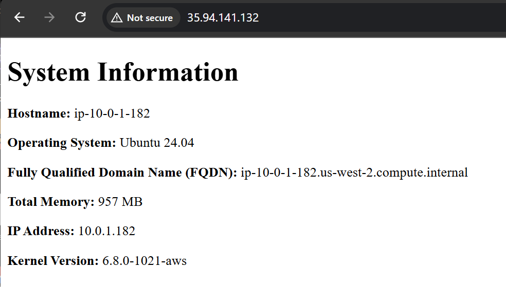
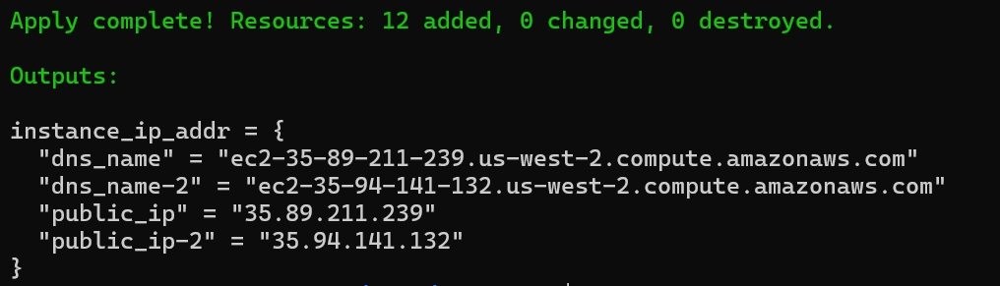
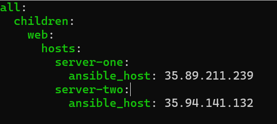

# 4640-W7-Lab7 Ansible

### Demo


### Create a new SSH key pair
```bash
ssh-keygen -t rsa -b 4096 -f aws
```
### Add the new public key to AWS account
```bash
./import_lab_key ~/.ssh/aws.pub
```
### Run run terraform configuration
```bash
terraform init
terraform apply
```


### Complete the hosts.yml in ansible/inventory 


### Complete the "playbook.yml" file
- install nginx on both servers with the package module
  ```bash
      - name: Install nginx
        ansible.builtin.package:
            name: nginx
            state: present # to ensure it's installed
  ```
- Create directory for index.html file using the file module
  ```bash
      - name: create directory structure for web documents
        ansible.builtin.file:
            path: /web/html 
            state: directory # to ensure it's a directory
            owner: www-data  
            group: www-data 
            mode: '0755'  # Set permissions
  ```
- copy the nginx.conf file to your servers with the copy module
  ```bash
      - name: copy nginx conf file to server
        ansible.builtin.copy:
            src: files/nginx.conf
            dest: /etc/nginx/sites-available/default
            owner: root
            group: root
            mode: '0644'
  ```
- make a link with the file module to /etc/nginx/sites-enabled/default
  ```bash
      - name: create link to nginx config file to enable it
        ansible.builtin.file:
            src: /etc/nginx/sites-available/default
            dest: /etc/nginx/sites-enabled/default # Create a symbolic link
            state: link # Ensure it's a symbolic link
  ```
- create an index.html file from the index.html.j2 template using the template module
  ```bash
      - name: Generate index.html file from template
        ansible.builtin.template:
            src: templates/index.html.j2
            dest: /web/html/index.html
            owner: www-data
            group: www-data
            mode: '0644'
  ```
- reload the nginx service with the service module
  ```bash
    - name: reload nginx service
        ansible.builtin.service:
            name: nginx
            state: restarted 
            enabled: yes # WEnsure the service starts at boot
  ```

### Validating Ansible playbooks
```bash
ansible-playbook --syntax-check playbook.yml
```

### Run Playbook
```bash
ansible-playbook -i ~/lab7/ansible/inventory/hosts.yml playbook.yml
```

### Cleanup
```bash
terraform destroy
```